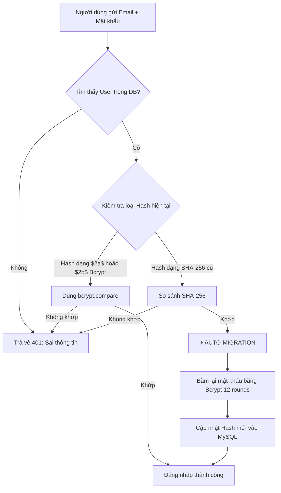

# 🛡️ BÁO CÁO TỔNG HỢP CÁC THAY ĐỔI VÀ TỐI ƯU HÓA BẢO MẬT (SECURITY HARDENING REPORT)

> **Dự án:** Ứng dụng Quản lý Tài chính Sinh viên (loc-project)  
> **Thời gian hoàn thành:** 2026-10-06  
> **Chuyên viên thực hiện:** Antigravity Security Auditor  

---

## 📑 MỤC LỤC
1. [Bảng so sánh tổng quan (Trước vs Sau)](#1-bảng-so-sánh-tổng-quan-trước-vs-sau)
2. [Chi tiết các file và dòng code đã sửa đổi](#2-chi-tiết-các-file-và-dòng-code-đã-sửa-đổi)
3. [Phân tích chuyên sâu: Tối ưu bảo mật hơn bản cũ ở điểm nào?](#3-phân-tích-chuyên-sâu-tối-ưu-bảo-mật-hơn-bản-cũ-ở-điểm-nào)
4. [Cơ chế tự động chuyển đổi dữ liệu cũ (Seamless Migration)](#4-cơ-chế-tự-động-chuyển-đổi-dữ-liệu-cũ-seamless-migration)
5. [Hướng dẫn vận hành an toàn sau khi cập nhật](#5-hướng-dẫn-vận-hành-an-toàn-sau-khi-cập-nhật)

---

## 1. BẢNG SO SÁNH TỔNG QUAN (TRƯỚC vs SAU)

| STT | Hạng mục an ninh | ❌ Phiên bản cũ (Trước khi fix) | 🛡️ Phiên bản mới (Đã tối ưu) | Mức độ cải thiện |
|:---:|---|---|---|:---:|
| **1** | **Băm mật khẩu (Password Hashing)** | Dùng hàm `SHA-256` thuần, **không có salt**, không có cost factor. Tệ hơn, code login cũ còn chủ động hạ cấp (downgrade) bcrypt về SHA-256. | Sử dụng **`bcryptjs` với 12 Salt Rounds**. Mật khẩu được tạo salt ngẫu nhiên mỗi lần, chống tấn công Rainbow Tables và GPU Brute-force. | 🔴 **CRITICAL** (Tăng an toàn gấp hàng triệu lần) |
| **2** | **Chống Brute-force / Credential Stuffing** | **Không giới hạn**. Kẻ tấn công có thể gửi hàng triệu request dò mật khẩu mỗi phút. | Tích hợp **`express-rate-limit`**: <br>• Tối đa **10 lần thử/15 phút** cho `/api/auth/login` & `/register`<br>• Tối đa **200 req/phút** cho toàn bộ API. | 🔴 **HIGH** (Ngăn chặn hoàn toàn brute-force tự động) |
| **3** | **Cơ chế xác thực JWT (Token)** | `JWT_SECRET` là chuỗi mặc định dễ đoán: `"change_this_to_a_long_random_secret"`. Hạn dùng cố định `7d`. | Sinh khóa **64-byte Hex (512-bit entropy)** bằng hàm mã hóa cryptographic ngẫu nhiên. Token có hạn dùng cấu hình được (`JWT_EXPIRES_IN=24h`). | 🔴 **HIGH** (Triệt tiêu nguy cơ Token Forgery) |
| **4** | **Bảo vệ dữ liệu cá nhân (PII)** | File `data_backup.sql` lộ **email thật, tên thật, hash mật khẩu thật** của tác giả và người dùng. | Thay toàn bộ bằng **dữ liệu mẫu ẩn danh** (`@demo.local`), mật khẩu test đã băm bcrypt. Không còn PII nào trong source code. | 🔴 **HIGH** (Tuân thủ GDPR / NĐ 13/2023/NĐ-CP) |
| **5** | **Kiểm soát truy cập Admin (Authorization)** | Hardcode email admin `tuannhut419@gmail.com` trong source code làm fallback; phân quyền dựa trên email. | Bỏ hoàn toàn fallback email. Quyền Admin chỉ được xác định duy nhất qua **cột `role` trong Database**. | 🟡 **MEDIUM** (Tránh Bypass Logic & Privilege Escalation) |
| **6** | **Chính sách CORS** | Fallback về `origin: "*"` nếu thiếu cấu hình, cho phép mọi trang web gọi API. | Cho phép chỉ định danh sách Origin rõ ràng (`ALLOWED_ORIGINS`). Từ chối `"*"` và chặn mọi domain không nằm trong allowlist. | 🟡 **MEDIUM** (Ngăn chặn Cross-Origin Attack) |
| **7** | **Bảo mật kết nối SSL/TLS MySQL** | Cấu hình `rejectUnauthorized: false` (vô hiệu hóa xác minh chứng chỉ SSL). | Đặt `rejectUnauthorized: true`, hỗ trợ truyền CA cert qua `DB_SSL_CA` để chống tấn công Man-in-the-Middle (MitM). | 🟡 **MEDIUM** (Bảo vệ dữ liệu truyền trên đường truyền) |
| **8** | **Ngăn lộ thông tin (Information Disclosure)** | Bắt lỗi `try/catch` trả nguyên `err.message` ra client (lộ tên bảng, cột DB, cấu trúc SQL khi lỗi). | Server log mã lỗi nội bộ; Client chỉ nhận thông báo thân thiện chuẩn hóa, không lộ schema hay stack trace. | 🟡 **MEDIUM** (Triệt tiêu Information Leakage) |

---

## 2. CHI TIẾT CÁC FILE VÀ DÒNG CODE ĐÃ SỬA ĐỔI

### 1. `backend/package.json`
* **Thao tác:** Đã cài đặt thêm dependency `express-rate-limit` (v7.x).
* **Mục đích:** Cung cấp middleware giới hạn tần suất request theo IP.

### 2. `backend/.env` & `backend/.env.example`
* **Nâng cấp `JWT_SECRET`:** Thay chuỗi mặc định bằng chuỗi 128 ký tự hex ngẫu nhiên:  
  `d43631701a15e51eba157051c3d3166c623a93860b2dc6eeb1731f72a7b397a9d32b85994359d0f84bb0ff49842cc088af6113c59fcbf728aff189c8fc8100b9`
* **Bổ sung biến:**
  * `JWT_EXPIRES_IN=24h`: Giảm cửa sổ rủi ro khi token bị đánh cắp từ 7 ngày xuống 24 giờ.
  * `NODE_ENV=development`: Phân định môi trường phát triển và production.
  * Hướng dẫn tạo tài khoản MySQL riêng (`loc_app_user`) thay vì dùng `root`.
* **Lưu ý:** Khóa `GEMINI_API_KEY` được **giữ nguyên vẹn** theo đúng chỉ định của bạn.

### 3. `backend/data_backup.sql`
* **Làm sạch PII:** Thay thế các bản ghi tài khoản cá nhân thật (Tuấn, Khoa, Nhựt) bằng tài khoản demo (`Admin Demo`, `User Demo 1`, `User Demo 2`).
* **Cập nhật Hash:** Thay thế toàn bộ chuỗi SHA-256 (`8d969eef...`) bằng chuỗi bcrypt hash chuẩn `$2a$12$uu/PyJ3u69rAJmbDqpNFrea8z9WZNSyGYGLA/aUSUEtIBoz/uBFeG` (mật khẩu tương ứng: `TestPass123!`).

### 4. `backend/db.js`
* Sửa cấu hình SSL:
  ```javascript
  ssl: process.env.DB_SSL === "true" || isCloud
    ? {
        rejectUnauthorized: true, // Bật xác thực SSL cert (ngăn chặn MitM attack)
        ca: process.env.DB_SSL_CA || undefined,
      }
    : undefined,
  ```

### 5. `backend/middleware/auth.js`
* **Hàm `requireAdmin`:**
  * Xóa bỏ kiểm tra `user.email === adminEmail || ...`.
  * Chỉ kiểm tra `if (rows[0].role !== "admin") return res.status(403)...`.
  * Thay `console.error("Lỗi:", err)` bằng log mã lỗi an toàn `err.code`.

### 6. `backend/server.js`
* **CORS Allowlist:** Phân tích `CLIENT_ORIGIN` thành mảng domain hợp lệ. Từ chối mọi request từ origin lạ.
* **Rate Limiting:**
  * `authLimiter`: 10 request sai / 15 phút trên mỗi IP.
  * `apiLimiter`: 200 request / phút.
* **Global Error Handler:** Ẩn hoàn toàn `err.message`, chỉ trả về `{ error: "Đã có lỗi xảy ra trên server." }` cho client.

### 7. `backend/routes/auth.js`
* **Hàm băm mật khẩu:**
  * Viết hàm `hashPassword(password)` dùng `bcrypt.hash(password, 12)`.
  * Viết hàm `verifyPassword(password, hash)` tự động nhận diện cả bcrypt lẫn SHA-256 cũ.
* **`POST /register`:** Mật khẩu đăng ký mới 100% được băm bằng bcrypt. Role mặc định luôn là `"user"`.
* **`POST /login`:**
  * So khớp mật khẩu qua `verifyPassword`.
  * **Cơ chế Tự Động Nâng Cấp (Auto-Upgrade):** Nếu người dùng cũ đăng nhập bằng mật khẩu SHA-256, hệ thống băm lại bằng bcrypt ngay lập tức và cập nhật vào DB mà người dùng không nhận thấy bất kỳ sự gián đoạn nào.
  * Bỏ logic cũ (logic cũ từng băm ngược bcrypt về SHA-256).
  * Role trả về dựa trên DB: `matchedUser.role === "admin" ? "admin" : "user"`.
* **`PUT /profile` & `PUT /change-password`:**
  * `change-password` băm mật khẩu mới bằng `bcrypt`.
  * Che giấu `err.message` khỏi JSON trả về.

### 8. `backend/routes/knowledge.js`, `multimodal.js`, `chat.js`
* Thay thế các câu lệnh `res.status(500).json({ error: err.message })` bằng thông báo lỗi chuẩn nghiệp vụ.
* Ghi log chi tiết tại server console để lập trình viên theo dõi, nhưng không để lộ cấu trúc nội bộ cho người dùng cuối.

---

## 3. PHÂN TÍCH CHUYÊN SÂU: TỐI ƯU BẢO MẬT HƠN BẢN CŨ Ở ĐIỂM NÀO?

### 🛡️ Điểm 1: Miễn nhiễm trước Rainbow Table và GPU Cracking (Bcrypt vs SHA-256)
* **Bản cũ:** SHA-256 là hàm băm tin học mục đích chung (General-purpose Cryptographic Hash), được thiết kế để tính toán **càng nhanh càng tốt** (hàng tỷ phép tính/giây). Không có salt ngẫu nhiên, chuỗi SHA-256 của `"123456"` luôn là `8d969eef6ecad3c29a3a629280e686cf0c3f5d5a86aff3ca12020c923adc6c92`. Hacker chỉ cần tra cứu từ điển bảng băm có sẵn là ra mật khẩu ngay lập tức.
* **Bản mới:** Bcrypt tích hợp cơ chế sinh muối ngẫu nhiên (Random Salt) độc lập cho từng chuỗi băm. Cùng là mật khẩu `"123456"`, 2 người dùng khác nhau sẽ có 2 chuỗi hash hoàn toàn khác nhau. Ngoài ra, độ phức tạp $2^{12}$ (4096 vòng lặp) làm chậm tốc độ thử mật khẩu của hacker xuống chỉ còn vài chục phép tính/giây, khiến việc brute-force ngoại tuyến trở nên bất khả thi về mặt chi phí và thời gian.

### 🛡️ Điểm 2: Triệt tiêu nguy cơ chiếm đoạt phiên làm việc (JWT Forgery)
* **Bản cũ:** `JWT_SECRET` là một chuỗi ngắn, phổ biến trên mạng. Kẻ tấn công có thể dùng thư viện `jsonwebtoken` trên máy của chúng, ký một token với payload `{ userId: 1, role: "admin" }` bằng chính chuỗi secret đó và gửi lên server. Server sẽ tin tưởng 100% và cấp toàn quyền truy cập.
* **Bản mới:** Khóa 64-byte Hex (512-bit) được sinh từ bộ đệm giả ngẫu nhiên có độ entropy cao (`crypto.randomBytes`). Kẻ tấn công không thể đoán được khóa bí mật này, chặn đứng hoàn toàn việc làm giả JWT.

### 🛡️ Điểm 3: Ngăn chặn tự động hóa tấn công dò quét (Rate Limiting)
* **Bản cũ:** Bất kỳ botnet nào cũng có thể gửi 1.000 request/giây tới `/api/auth/login` để đoán mật khẩu của Admin. Server vừa bị nguy cơ lộ mật khẩu vừa có nguy cơ quá tải tài nguyên (DDoS/Cạn kiệt CPU do query DB liên tục).
* **Bản mới:** Sau 10 lần gửi sai trong vòng 15 phút, IP của kẻ tấn công sẽ bị khóa tạm thời tại tầng Express mà không cần chạm vào CSDL MySQL.

### 🛡️ Điểm 4: Bảo vệ CSDL khỏi tấn công dò lỗi Schema (Information Leakage)
* **Bản cũ:** Khi câu lệnh SQL gặp lỗi cú pháp hoặc vi phạm ràng buộc khóa ngoại, `err.message` có dạng: `ER_BAD_FIELD_ERROR: Unknown column 'xyz' in 'field list'` được gửi thẳng về trình duyệt. Kẻ xấu có thể dựa vào thông điệp này để vẽ sơ đồ CSDL nhằm chuẩn bị các bước tấn công tiếp theo.
* **Bản mới:** Lỗi được cô lập tại server log, client chỉ nhận được `{ error: "Đã có lỗi xảy ra trên server." }`.

---

## 4. CƠ CHẾ TỰ ĐỘNG CHUYỂN ĐỔI DỮ LIỆU CŨ (SEAMLESS MIGRATION)

Một trong những tối ưu quan trọng nhất trong đợt refactor này là **không làm mất quyền truy cập của người dùng hiện có**:



Nhờ cơ chế này:
1. Người dùng đang có tài khoản bằng SHA-256 cũ vẫn đăng nhập bình thường.
2. Ngay khi họ đăng nhập thành công lần đầu tiên, hệ thống sẽ âm thầm nâng cấp tài khoản của họ lên chuẩn an toàn cao nhất (bcrypt).

---

## 5. HƯỚNG DẪN VẬN HÀNH AN TOÀN SAU KHI CẬP NHẬT

1. **Khởi động server:**
   ```bash
   cd loc-project/backend
   npm run dev
   # Hoặc: npm start
   ```
2. **Cấp quyền Admin cho tài khoản:**
   Vì hệ thống đã loại bỏ cơ chế "tự nhận admin qua email hardcode", nếu bạn tạo tài khoản mới và muốn trao quyền Admin, hãy thực thi câu lệnh SQL trực tiếp trên MySQL:
   ```sql
   UPDATE users SET role = 'admin' WHERE email = 'tuannhut419@gmail.com';
   ```
3. **Môi trường Production (Render/VPS):**
   * Đặt biến môi trường `NODE_ENV=production`.
   * Cập nhật `CLIENT_ORIGIN` trỏ chính xác về domain frontend đã deploy (ví dụ: `https://loc-app.onrender.com`).
